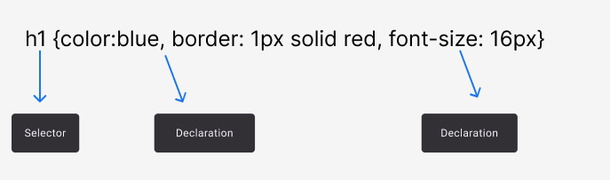
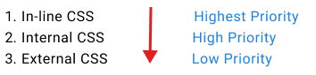

import { FontStyle } from "../../src/components";

# CSS - Cascading Style Sheet

#### HTML forms the structure of a webpage, like a skeleton, while CSS styles it, acting as the visual layer or skin.

<FontStyle
  text=" CSS is based on selectors, we can apply styles to element using selectors"
  heading="h3"
  color="blue"
/>



### CSS Box Modal


## How To apply CSS to webpage.

<details>
    <summary> 1. Inline CSS </summary>
    <p> Inline CSS is directly applied to element </p>

    ```html
    <p style={color:red}> Some Text here </p>
    ```

</details>

<details>
    <summary> 2. Internal CSS </summary>
    <p> Internal CSS is added into head tag of HTML using style tag </p>

    ```html
    <!DOCTYPE html >
    <html>
        <head>
            <meta name="author" content="Yash">
            <style>
                .p {color=red};
            </style>
        </head>
        <body>
            <p> This is Internal CSS Style </p>
        </body>
    </html>
    ```

</details>

<details>
    <summary> 3. External CSS </summary>
    <p>External CSS involves linking a separate CSS file to an HTML document, allowing styles to be applied to elements using selectors for consistent and reusable design.</p>

    ```html
    <!DOCTYPE HTML>
    <html>
        <head>
            <meta name="viewport" content="width=device-width, initial-scale=1.0" />
            <link rel="stylesheet" href="styles.css" />
        </head>
        <body>
            <p classname="text-style"> This is external CSS </p>
        </body>
    </html>
    ```

</details>

<FontStyle text=" Priority of styles" heading="h3" color="orange" />

