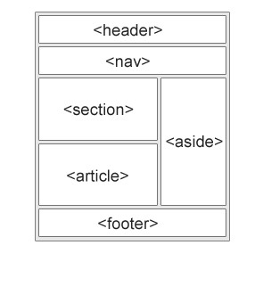

import { FontStyle } from "../../src/components";

# HTML Semantics Element

There are some html semantics element, used for clean code and better readability.

<FontStyle text="1. Header" heading="h4" color="blue" />

- Define header block for a document.
- This is not head element, this one is used inside body tag.

<FontStyle text="2. Nav" heading="h4" color="blue" />

- Used for navigation bar in document.

<FontStyle text="3. Aside" heading="h4" color="blue" />

- For sidebar related content in page

<FontStyle text="4. Section" heading="h4" color="blue" />

- This is a generic element in page, that describe the section content of page.

<FontStyle text="5. Article" heading="h4" color="blue" />

- Article element is used for article post on page.

<FontStyle text="6. Address" heading="h4" color="blue" />

- In address tag, content will start and end with a new line.
- Used for display address or contact related content.
- `<address>`

