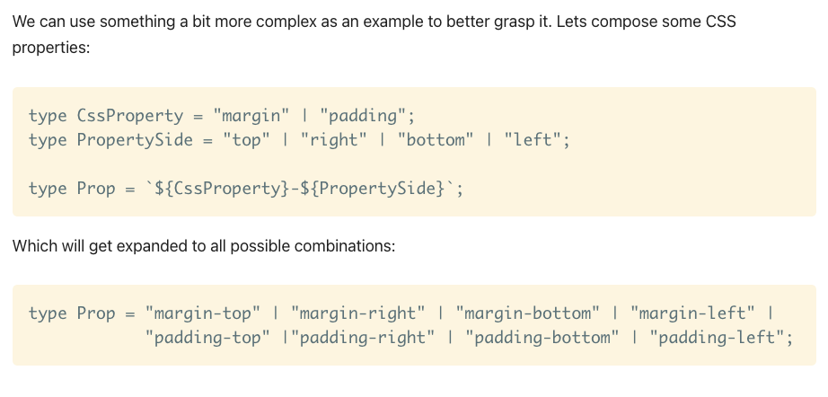
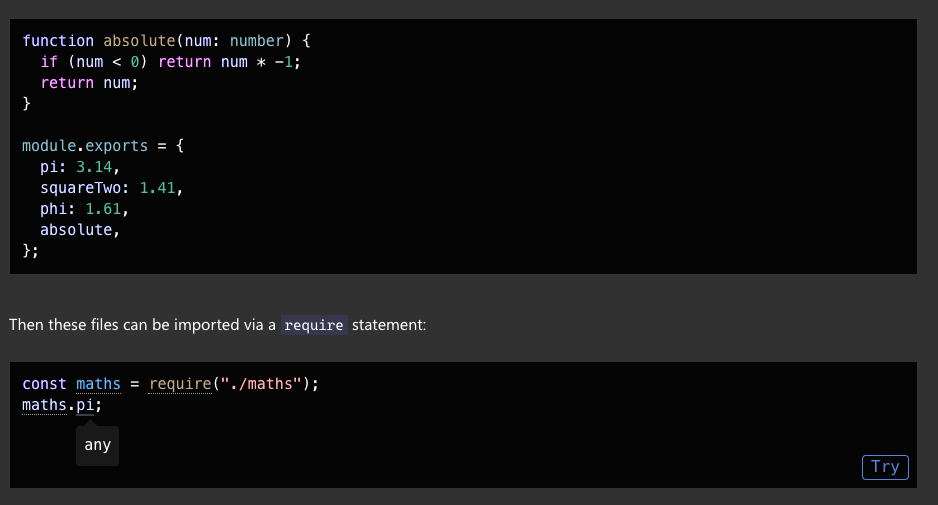
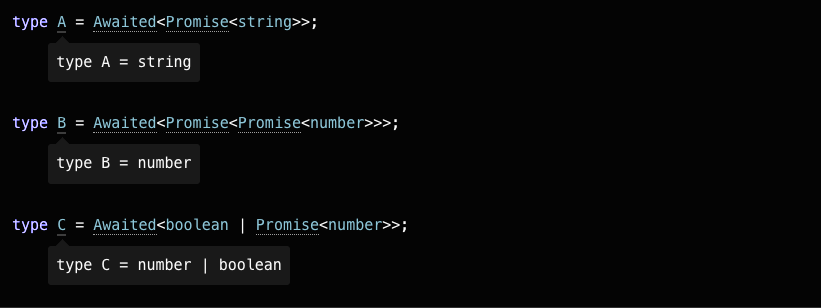
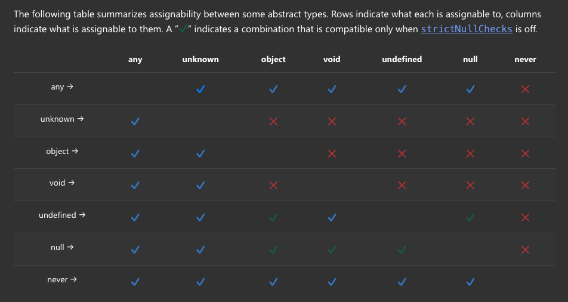
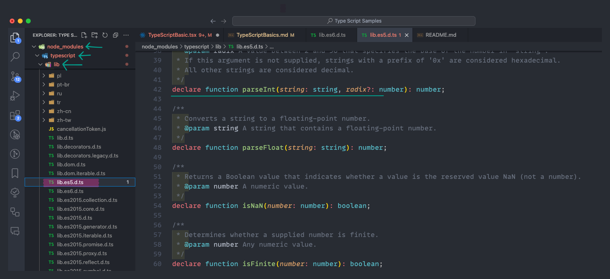
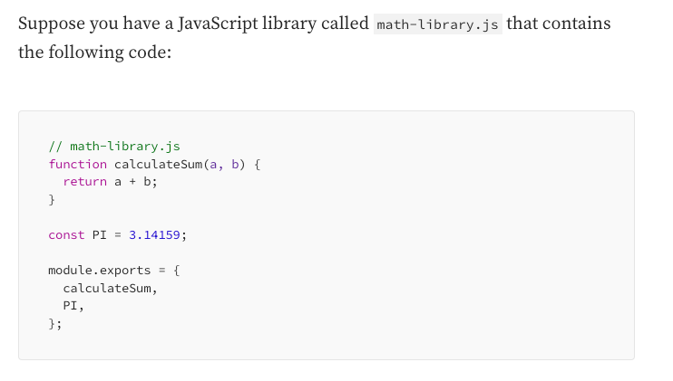
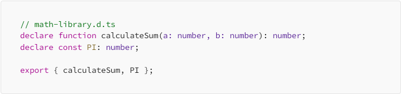

# Composing Types

- In typescript we can also compose complex types using available types, There are two ways to compose types:

1. Unions ( | )
2. Generics

- Unions:
  In this doc we already discussed about unions, it is a way to define a type that can be one of the several types.

- Generics:
  Generics provide variables to types, **generis are like a variable that stores type (like number,string,boolean) as a values**

[**Link to a good docs about Generics in TypeScript**](https://www.freecodecamp.org/news/typescript-generics-use-case-example/)

- Let's start with simple example, in below function we have only 1 argument than it will be easy to explicitly define type:

```js
function printData(data: number) {
  console.log("data: ", data);
}

printData(2);
```

- Now if we want ot make this function more generic (more arguments) we can use Unions as below:

```js
function printData(data: number | string | boolean) {
  console.log("data: ", data);
}

printData(2);
printData("hello");
printData(true);
```

- But if we want to pass array of string or object with complex data types than it will be difficult to define type explicitly, so in this case we can use Generics.

```js
function printData'T>(data: T) {
  console.log("data: ", data);
  return data[0];
}

printData(2);
printData("hello");
printData(true);
printData([1, 2, 3, 4, 5, 6]);
printData([1, 2, 3, "hi"]);
printData({ name: "Ram", rollNo: 1 });
```

- **Here we use type ("T") variable inside angular brackets after function, And than assign type variable to function parameter**

- **Inside angular brackets we define type variable T but it can be anything as per our preference like X,Y,Z etc**

- **Now, whatever argument you pass to the function, it gets inferred and there's no need to hardcode the type anywhere.**

- Even if you pass an array of numbers or an object to the printData function, everything will be displayed properly without TS complaining

- Another example

```js
function printData'X, Y>(data1: X, data2: Y) {
  console.log("Output is: ", data1, data2);
}

printData("Hello", "World");
printData(123, ["Hi", 123]);
```

- **Another simple example with function calling:**

```js
//generics in Function
function arrayModifier'T>(a: T, b: T[]): T[] {
  return [a, ...b];
}

//There is two way we can call this function

//First way, we can explicitly define the type
console.log(arrayModifier ' number > (12, [11, 22, 44]));
//Here we are explicitly defining the type to number

//Second way we can let the type be inferred by the argument
console.log(arrayModifier("Hello", ["World", "!"]));
//Here we let the type (string) be inferred by the argument
```

- #### We can also use generics with object interface:

```js
interface UserData'X, Y> {
  name: X;
  rollNo: Y;
}
// Here with the use of generics (type variable inside angular brackets) we made re-usable interface.

const user: UserData'string, number> = {
  name: "Ram",
  rollNo: 1,
};

//Re-using UserData interface with different types.
const user1: userData'string[], boolean> = {
  name: ["Ram", "Shyam"],
  rollNo: true,
};
```

- In above snippet, (string, number) are passed to the interface UserData. In this way, UserData becomes a reusable interface in which any data type can be assigned depending upon the use case.

## Function is TS

- We have to define parameter types and return type of function.

```js
/Function
//Function with return type
function add(a:number,b:number):number{
    return a+b
}

//Function without return type, void can be used to define no return type
function addNum(a:number,b:number):void{
    console.log(a+b)
}

//Type aliases with arrow function
type Count = (value:number) => number;
//here this sentence means that Count is a type which is a function that takes a number and returns a number

const countNumber : Count = (value) => value*1
//here countNumber is a function that takes a number and returns a number


//In functions name of the parameters can be different from declared in type but order should be same
type searchFn = (query:string,data:string[]) => string[]
    const getQuery:searchFn = function(name,arraydata){
    return arraydata.filter((item) => item.includes(name))
}
```

- If a function is returning a promise then we have to define the return type of promise.

  ```js
  async function getItems(): Promise'Item[]> {
    return await fetchItems();
  }
  ```

- Arrow function in typescript

```js
//Arrow function
const add = (a: number, b: number): number => a + b;
//here add is a function that takes two numbers and returns a number
```

- #### Call Signature in Function:

* We know that in javascript we can have properties associated with functions, so when working with function properties "type expression syntax" as listed above won't allow to declare types. In this case we can use "Call Signature" to declare types

```js
//Defining call signature for a function
type SecondFunction = {
  //Object type
  description: string, //Property
  (x: number): boolean, //Call Signature
};

function mainFunction(fn: SecondFunction) {
  console.log(fn.description + ": " + fn(5));
}

function checkValidity(x: number): boolean {
  return x ' 3;
}
//Adding description property to a function.
checkValidity.description = "Given number is less than 3";

mainFunction(checkValidity);
```

- Type script **Call Signature** within an object type (SecondFunction) defines an object that are callable, means they can be invoked like a function and can also have properties associated with them (like description property above).

- This feature allows us to create an object that act both as a function and as an object.This objects are referred as a **Callable Object**.

- Here x is a property of an callable object function expects with its type and boolean is a return type of a function.

[**Function with Properties**](https://www.geeksforgeeks.org/typescript-call-signatures/)

- Another example of call signature:

```js
//Call signatures another example

type callableObject = {
  (arg1: number, arg2: number): number, //call signature
  description: string, //property
};

const addition: callableObject = (x, y) => x + y;
addition.description = "Addition of two numbers";

const subtract: callableObject = (x, y) => x - y;
subtract.description = "Subtraction of two numbers";

const multiply: callableObject = (x, y) => x * y;
multiply.description = "Multiplication of numbers";

const sum = addition(5, 6); //11
console.log(`${addition.description} is ${sum}`);

const diff = subtract(10, 6); //4
console.log(`${subtract.description} is ${diff}`);
```

- #### Generics in Function:
  we can use generics types in functions, in generics types are inferred by typescript itself.

```js
// Here X[] will string of array(Array'string>) and Y will be number(Array'number>) of array which is returned by function
function map'X, Y>(arr: X[], func: (arg: X) => Y): Y[] {
  return arr.map(func);
}
// Here X[] will be string[]
//In (arg:X) X will be string
//In (and => Y) Y will be a number
//So Y[] will be number[]

// Parameter 'n' is of type 'string'
// 'parsed' is of type 'number[]'
const parsed = map(["1vcy", "2", "3kop"], (n) => parseInt(n));
```

- #### In Function if we want to merge or combine two different types we need to explicitly define the argument type:

```js
function combine'T>(arr1: T[], arr2: T[]): T[] {
  return arr1.concat(arr2);
}

console.log(combine([1, 2, 3], ["x", "y", "z"]));
// Here it will throw error as not able to assign string to number type of array(In concat method we are adding string to number array).

/// Solution to this

function combine'T>(arr1: T[], arr2: T[]): T[] {
  return arr1.concat(arr2);
}

// Explicitly defining the type of array.
console.log((combine ' number) | (string > ([1, 2, 3], ["x", "y", "z"])));
```

- ##### In Function if we don't know if the argument will be passed or not than we can use "Optional parameter" by adding "?" after parameter name:

```js
function printName(firstName: string, lastName?: string) {
  console.log(firstName + " " + lastName);
}

printName("Yashpal");
printName("Yashpal", "Sinh");
```

- **In object destructuring we can explicitly define types after destructured object**:

````js
function sum({ a, b, c }: { a: number; b: number; c: number }) {
    console.log(a + b + c);
}
    ```


### Function Overloading:

- Concept is that if we want to call a function with different types of arguments, or we have 3 possible types of arguments possible but we are not sure when we will be calling function with which type of argument than we can use function overloading.

- Consider the following data structure we set up for our e-commerce shop. We have customers, products, and orders. Customers have an ID, a first name, and a last name.

- We want to provide a fetchOrder function, which works as follows:
1. If we pass a customer, we get a list of orders from this
customer.
2. If we pass a product, we get a list of orders that include
this product.
3. If we pass an order ID, we just get that particular order.


```js
type Customer = {
    id:number
    name:string
}

type Product ={
    id:number
    name:string
    price:number
}

type Order = {
    orderID:number
    customer:Customer
    products:Product[]
    date:Date
}

// If we want a fetch function that can fetch any of these types, we can use function overloading to define the function signature for each type.

function fetchOrder(customer:Customer):Order[] // return type will be array of Orders type
function fetchOrder(product:Product):Order[]
function fetchOrder(orderID:number):Order
function fetchOrder(param:any):any{
    //Implementation of function
}

// We can go more in this but for some more complex cases we can use optional parameters and union types.

type FetchParams = Customer|Product|number;
type FetchReturn'Type extend FetchParams> = Type extend Customer ? Order[] : Type extend Product ? Order[] : Order;§

function fetchOrder'Type extend FetchParams>(args:Type):FetchReturn(type)  {
    //Implementation of function
}
````

## Narrowing in TypeScript

- Within our if check, TypeScript sees "typeof" padding === "number" and understands that as a special form of code called a type guard. TypeScript follows possible paths of execution that our programs can take to analyze the most specific possible type of a value at a given position. It looks at these special checks (called type guards) and assignments, and the process of refining types to more specific types than declared is called narrowing.

```js
//Narrowing
function padLeft(padding: number | string, input: string): string {
  if (typeof padding === "number") {
    return " ".repeat(padding) + input;
  }
  return padding + input;
}
```

**Here we have defined union types (string or number) but by this type guard (if condition and === operator) TS tries to find out the exact type of padding, this process is called Narrowing**

## Type Manipulations in TypeScript:

- **Type manipulation** is way of creating types from types.

#### 1. Generics:

- We already discussed about generics in type composing.

#### 2. "keyof" type operator:

- "keyof" operator takes an object and produce a literal union of its keys.

```js
//keyof
interface Person {
    name: string;
    age: number;
    location: string;
}

type PersonKeys = keyof Person;
//PersonKeys will be "name" | "age" | "location"
```

#### 3. "typeof" type operator:

- "typeof" type operator is little bit similar to java script typeof function, in typescript it is used to get the type of a variable or property.

- Typeof operator abstracts the type structure from given type.

- If we are abstracting type from a variable than it will give value of that variable as a type

```js
//typeof operator
const value = "Hello";

type Value = typeof value;
//Value will be "Hello"

const person = {
  name: "Yash",
  age: 30,
  location: "India",
};

type Person = typeof person;
//Person will be {name: string, age: number, location: string}
```

#### 4. Indexed Access Types:

- Indexed access types are used to get the type of a property from another type.

```js
//Indexed Access Types
interface Person {
  name: string;
  age: number;
  location: string;
}

type Age = Person["age"];
//type of Age will be a number
```

#### 5. Conditional Types:

- Doing some condition checks o available types we can get a type on the basis of condition.

```js
// Conditional types
//Doing some conditional checking on available type we can get type

interface Animal {
    live(): void;
}
interface Dog extends Animal {
    woof(): void;
}
interface Bird {
    fly:boolean;
}

type Example1 = Dog extends Animal ? number : string;
// Example3= number

type Example2 = RegExp extends Animal ? number : string;
// Example3= sting because RegExp is not extending Animal

type Example3 = Bird extends Animal ? string : number;
// Example3= number because Bird is not extending Animal
```

#### 6 .Mapped Types:

- **Mapped word means that we are mapping on some data to get new updated data or we can say that we are transforming data to get new data.**

- **MAPPED TYPES** have a relationship with the type from they are derived, mostly they are used to modify existing type with added type capabilities.

- **So any changes in base type will also reflect in mapped types.**

- In TS mapped types are types which are derived from other types using "in","keyof" and string index signature.

````js
//Mapped types

type OurObject = { // simple object type
    name:string;
    age:number;
}

type MappedfromOurObject = {
    [key in keyof OurObject]:OurObject[key] | boolean
}
//New type will be as below
// MappedfromOurObject = {
//   name:string | boolean;
//   age:number | boolean;

// Here we mapped a new type from existing OurObject type in which it have all existing properties and type with new union type added (boolean) to each property.
    ```


#### 7. Template Literal Types:

- Template literal type are derived from a **string literal types**:

```js
//Template literals types
type NameString = `name`; //this is a simple string literal type
type templateType = `hello ${NameString}`; // template literal type
//templateType will be "hello name"
````

- We can get many more types using union and template literals, As in below code we got all possible combinations of css box properties.

- **This is best example of template literal usage**



## Modules in TypeScript:

- **REQUIRE VS IMPORT & EXPORT**: We have two type of module system.

  1. CommonJS Modules (require and module.exports).
  2. EcmaScript Modules (import and export).

- Any file containing a top level "import" or "export" is considered a module, Modules are executed within their own scope not in global scope means a variables, functions, classes etc defined inside module are not accessible outside of the module, unless they are explicitly exported using "export" and imported using "import".

- While any file not containing "import" or "export" is considered a **script** and whose content are available in global scope.

- Inside a script file variables and types are declared to be in the shared global scope, and it’s assumed that you’ll either use the outFile compiler option to join multiple input files into one output file, or use multiple script tags in your HTML to load these files (in the correct order!).

- In typescript types are exported and imported same as javascript values using import and export keywords.

- In javascript **import /logFiles.js** will evaluate file on initial load of the module.

- We can use **import type** to indicate that we are importing only types and this helps non-tsc compiler to know that we are importing only types.

- Normally we use Es module syntax (import and export) but we may require to use **commonJS** syntax **module.exports** and **require** in some cases.



## Utility Types in TypeScript:

- Utility types are useful generics types available globally in typescript.

#### 1. "Awaited (type)":

- Used with asynchronous operations like async, await , then promise handlers.



#### 2."Partial(type)":

- **Partial will make properties of given type optional.**

```js
//Partial type
interface Todo {
  title: string;
  description: string;
}

function updateTodo(todo: Todo, fieldsToUpdate: Partial'Todo>) {
  return { ...todo, ...fieldsToUpdate };
}
// Partial will make Todo type title and description properties optional so in todo2 we only pass description and Ts does't complain about it.

const todo1 = {
  title: "organize desk",
  description: "clear clutter",
};

const todo2 = updateTodo(todo1, {
  description: "throw out trash",
});
```

#### 3. Required(type):

- This is opposite of Partial it sets all properties to required.

```js
interface Props {
  a?: number;
  b?: string;
}

const obj: Props = { a: 5 }; // OK
const obj2: Required'Props> = { a: 5 }; // Error: property 'b' is missing
```

#### 4. Readonly(type):

- Set given types to readonly so the values can't be reassigned.

```js
interface Todo {
  title: string;
}

const todo: Readonly'Todo> = {
  title: "Delete inactive users",
};

todo.title = "Hello"; // Error: cannot reassign a readonly property
```

#### 5. Record 'Keys,Type':

- This utility map key to type.

```js
interface CatInfo {
  age: number;
  breed: string;
}

type CatName = "miffy" | "boris" | "mordred";
// Here it map catName miffy/boris/mordred to CatInfo type
const cats: Record'CatName, CatInfo> = {
  miffy: { age: 10, breed: "Persian" }, // so miffy have catInfo type
  boris: { age: 5, breed: "Maine Coon" },
  mordred: { age: 16, breed: "British Shorthair" },
};

cats.boris;
```

#### 6. Pick 'Type,Keys':

- Pick type picks those particular keys from given type and construct a new type.

- In simple given keys from type object.

```js
interface credentials {
  name: string;
  email: string;
  password: string;
  age: number;
}

//Now we want to create a new type which will only have few properties from credentials type
type login = Pick'credentials, "email" | "password">;
// login type will have only email and password properties from credentials type.

type resetPassword = Pick'credentials, "email">;
// resetPassword type will have only email property from credentials type.
```

#### 5. Omit'Type,Keys':

- opposite of Pick Omit will not include given key from Type.

```js
interface credentials {
  name: string;
  email: string;
  password: string;
  age: number;
}

//Now we want to create a new type which will omit email and password properties from credentials type
type Status = Omit'credentials, "email" | "password">;
// Status will only have name and age properties from credentials type.
```

#### 6. Exclude'UnionType,ExcludedUnion>:

- his utility will exclude given union from Union type.

```js
type T0 = Exclude'"a" | "b" | "c", "a">; // "b" | "c"
// here from union a|b|c, a will be excluded.
type T1 = Exclude'"a" | "b" | "c", "a" | "b">; // "c"
// here from union a and b will be excluded.
type T2 = Exclude'string | number | (() => void), Function>; // string | number
```

#### 7. Extract'Type,IncludedUnion>:

- Extract or get given union or type from Type.

```js
    typeT3 = Extract'"a"|"b"|"c"|"d","b"|"d"|"e"> // "b" | "d"
    // so it extract available union from given union.
```

#### 8. NonNullable(type):

- Construct a type from given type by excluding **null** and **undefined** type.

```js
type T0 = NonNullable'string | number | undefined>; // string | number
type T1 = NonNullable'string | string[] | null | undefined>; // string | string[]
```

#### 9. Parameters(type):

- This type construct type from a function parameters.

```js
declare function f1(arg: { a: number, b: string }): void;
type T0 = Parameters'() => string>; // []
type T1 = Parameters'(s: string) => void>; // [string]
type T2 = Parameters''T>(arg: T) => T>; // [unknown]
type T3 = Parameters'typeof f1>; // [{ a: number, b: string }]
type T4 = Parameters'any>; // unknown[]
type T5 = Parameters'never>; // never
type T6 = Parameters'string>; // Error
```

#### 10. String Manipulations Types:

```ts
-Uppercase '
  StringType >
  -Lowercase '
  StringType >
  -Capitalize '
  StringType >
  -Uncapitalize'StringType>;
```

## Symbols in TypeScript:

- **Symbols** are primitive data types in java script and used as unique keys for object properties.

```js
const sym = Symbol();
let obj = {
  [sym]: "value",
};
console.log(obj[sym]); // "value"
```

## Type Compatibility in TypeScript:



- Everything is assignable to itself.

- any and unknown are the same in terms of what is assignable to them, different in that unknown is not assignable to anything except any.

- unknown and never are like inverses of each other. Everything is assignable to unknown, never is assignable to everything. Nothing is assignable to never, unknown is not assignable to anything (except any).

- void is not assignable to or from anything, with the following exceptions: any, unknown, never, undefined, and null (if strictNullChecks is off, see table for details).

- When strictNullChecks is off, null and undefined are similar to never: assignable to most types, most types are not assignable to them. They are assignable to each other.

## Declaration Files in TypeScript(.d.ts and declare keyword):

- [**For details about Declaration Files check this blog**](https://blog.ohansemmanuel.com/what-is-a-dts-file-in-typescript/)

- This files only contain type information no actual source code or business logic.

- **Declaration files are used to provide type information about javascript libraries or modules that don't have built in typescript support.**

- They allow to use external javascript code in typescript projects while benefiting from Typescript's type checking.

- These files normally have **.d.ts** extension and include type declaration for variables, functions, classes, etc found in javascript code or library.

- A Type Declaration file, as the name suggests, only contains the type declarations and not the actual source code (business logic). These files are meant to only provide aid to the development process and not become part of the compilation itself.

- How we get types of In-built API or functions? The answer is declaration files which are included in typescript bundle, so in below image we can see there are many .d.ts files which are defining types for in-built functions and API.





- To us this file in typescript and have type checking, we need to create **math-library.d.ts** file and declare types.



### - Now what if we are using a external library or API, than how to get type declaration for that?

- There are three ways to get type declaration for external library or API:

1. **Bundled Types**:

   - Many libraries and API comes with bundled types, so when we install them using npm or yarn, we get types along with them.

2. **Definitely Typed (@types)**:

   - There is a central public repository called [**Definitely Typed Repository**](https://github.com/DefinitelyTyped/DefinitelyTyped/) holds declaration files for thousands of libraries.

   - These type definition files are automatically published to **npm** under the **@types** scope.

   - For an example if we want to install react npm packages we can do by this command:

     - npm install react
     - npm install --save-dev @types/react

   - Definition files added in this manner will be saved to **node_modules/@types** directory.

   - So typescript will automatically find and use these types when we import the library.

3. **Writing our own Declaration files**:
   - If library is not bundled types or we can't find types in Definitely Types repository, than we can write our own declaration files.

## Value as a Type in TypeScript: Literal Types

- We cab have a value as a type in typescript.

```js
const value = "Hello";
type Value = typeof value;
//Value will be "Hello"
type EventKind = "webinar" | "conference" | "meetup";
```

## Namespaces in TypeScript:

- Namespaces are used to organize code and prevent naming conflicts.

- **Namespaces let you specify closures where you can export functions and types,this allow to use names that would't conflict with other names in the global scope.**

```typescript
//namespace
namespace AlbumCollection{ // In global scope we crated namespace AlbumCollection and it had nested namespace Album and sales. now they are in closure of AlbumCollection namespace.

    export namespace Album{
        export interface Album{
            name:string;
            artist:string;
            year:number
        }
    }

    export namespace sales{
        export function recordSales(album:Album.Album){
            console.log(`Sales recorded for ${album.name} by ${album.artist}`)
        }
    }

    export calculatedSales(albumTitle:string){
        //Implementation
    }
}

// Now in our file we can access this album and sales globally function and types which are in closure of AlbumCollection namespace.

const queen = AlbumCollection.Album.Album = {
    name:"A Night at the Opera",
    artist:"Queen",
    year:1975
}

AlbumCollection.sales.recordSales(queen)

```

### Merging Namespaces:

- Namespaces can be merged as interfaces, so if we declared one namespace with AlbumCollection and with same name than as happens in interfaces they will be merged.

```typescript
    namespace AlbumCollection {
        export namespace Album {
            export interface Album {
                title: string;
                artist: string;
                year: number;
            }
        }
    }

    namespace AlbumCollection{
        export namespace sales{
            export namespace recordSales(title:string){
                //Implementation
            }
        }
    }

    //Here AlbumCollection namespace will have Album and sales namespace merged.

    const loaded:AlbumCollection.Album.Album ={
        title:"A Night at the Opera",
        artist:"Queen",
        year:1975
    }

    AlbumCollection.sales.recordSales("queen") //Here we can access recordSales function from AlbumCollection because both same name namespaces were merged.

```

### Merging Interfaces inside namespaces:

- If a namespaces sharing same name and same interface than they both will be merged.

```typescript
namespace AlbumCollection {
  export interface Album {
    title: string;
    artist: string;
    year: number;
  }
}

namespace AlbumCollection {
  export interface Album {
    genre: string;
  }
}

//Here AlbumCollection namespace will have Album interface merged.

const loaded: AlbumCollection.Album = {
  title: "A Night at the Opera",
  artist: "Queen",
  year: 1975,
  genre: "Rock",
};
```
