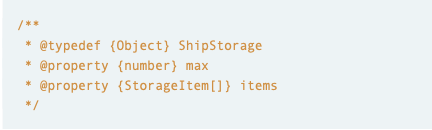
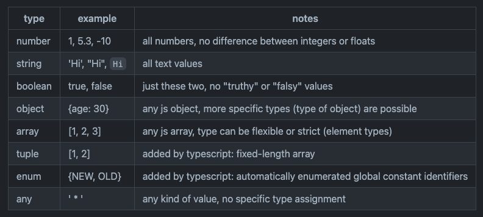

# Introduction

Welcome to TypeScript tutorials.

This is the series of the tutorials in which we will post regarding the problem faced by use while developing the website.

### What is TypeScript ?
TypeScript is a superset of JavaScript that compiles to plain JavaScript. It is a statically typed language that supports object-oriented, functional, and procedural programming styles. TypeScript is developed and maintained by Microsoft.

### What is type in TypeScript ?
Type in defining what kind of operation can be performed on given data, type describe how the data should be handled. 

  * JS is weakly typed means once type is declared it can be re-declared or reassigned to different type
  * TS is strongly typed, Ts want to stick initial type only.

### How we can declare types in TypeScript ?
- We can use Js Doc comments to declare types (Not recommended):

- Type declaration file: We can use type declaration file with `.d.ts` suffix to define types there and export them.

- Explicit define types using annotation:
`let x: string[] = []`
here we are defining that `x` will a string of array.

### What are the different types in TypeScript ?
- Boolean
- Number
- String
- Array
- Tuple
- Enum
- Any
- Void
- Null
- Undefined
- Never
- Object
- Function
- Interface
- Type Assertion

### What are the most used types ?
