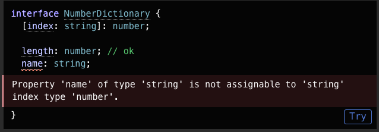

# Types
Here is the list of the types that are supported by TypeScript. Also the functioning of types are demonstrated here.

### Object
Any JavaScript Object,Optional properties need to be typed using `?.` operator.

**Object types can be defined anonymously or by using interfaces or type aliases.**

```js
//Object type anonymous
//Defining explicitly types of object properties
let ourObject:{name:string,age:number,onLeave:boolean} = {name:"john doe",age:30,onLeave:false}


//Type Inference (Type will be derived from the value assigned to it)
let ourObject1 = {name:"john doe",age:30,onLeave:false}

//Interface
interface Person {
    name:string;
    age:number;
    onLeave:boolean;
}
let ourObject2: Person = {name:"john doe",age:30,onLeave:false}


//Type Aliases
type Person = {
    name:string;
    age:number;
    onLeave:boolean;
}
let ourObject3: Person = {name:"john doe",age:30,onLeave:false}


//Optional Properties
let ourObject4:{name:string,age:number} = {name:"john doe"}
ourObject4.age = 30
//Ths will give error as age is not defined or property is missing


//Optional properties can be defined using "?"
let ourObject5:{name:string,age?:number} = {name:"john doe"}
ourObject5.age = 30
//This will not give error as age is optional property is explicitly defined using "?"
```

When working with optional properties,if optional properties is not provided that as per Js it will give undefined , so to avoid this we can use java script option chaining `?.` to check if property is present or not.

#### Index Signature
Index signature is used to type an object whose structure is unknown at that time but we know type of `key` and `value` of an object.

```js
//Index Signature
interface SalaryObject {
    [key:string]:number
}

// here we define that a object will have a key of string and value as a number.

function totalSalary(dataObj:SalaryObject) {
    let total = 0
    for (let name in dataObj) {
        total =+ dataObj[name];
    }
    return total
}
```

Only some types are allowed as a index signature properties: string,number,symbol,template string pattern and unions.
string index signature `( [key:string])` enforce that values of all properties of an object must be index signature value type, so if `([key:string]:number)` than `color:string` property will give an error



In TypeScript if we are not sure about number of properties of an object we can use `string Index Signature`.

```js
interface SquareConfig {
    color?:string;
    area?:number;
    [key:string]:any;
}
function createSquare(areaObj:SquareConfig): {color:string;area:number} {
    return {
        color:areaObj.color || "white",
        area:areaObj.area * areaObj.color || 100
    }
}

let mySquare = createSquare({color:"black",area:50,opacity:0.9})
// This will also work fine as color & area are optionally defined and opacity is defined using string index signature
```

In typescript we can extend current type to any other type using `extend` keyword.

```js
interface BasicAddress {
    name?: string;
    street: string;
    city: string;
    country: string;
    postalCode: string;
}

interface AddressWithUnit extends BasicAddress {
    unit: string;
}
//Now AddressWithUnit will have all properties of BasicAddress and "unit" property as well.
```

### Array
Any JavaScript Array `readonly` keyword can prevent arrays from being changed.

In array `number[]` or `Array<number>` both are same, first one is shorthand of second one

```js
//Array
let ourNumber: number[] = [1,2,3,4,5];
//here a is an array of numbers
let ourString: string[] = ["a","b","c","d"];

//readonly keyword can prevent the array from being changed
let ourNumber1: readonly number[] = [1,2,3,4,5];
//Or another way
let ourNumber2: ReadonlyArray<number> = [1,2,3,4,5,9];
```

### Tuple
Tuple in new added in TS, tuple is a array with pre-defined length and types for each index in tuple

```js
//Tuple
//tuple is an array with fixed length and types for each index
let ourTuple: [string,number] = ["john doe",30]
//Initialized correctly

let ourTuple1: [string,number] = [30,"john doe"]
//Initialized incorrectly, this will throw an error with different types
```

### Enum
An enum is a special `class` that represents a group of constants. Enums are one of the few features TypeScript has which is not a type-level extension of JavaScript. Enums allow a developer to define a set of named constants. Using enums can make it easier to document intent, or create a set of distinct cases. TypeScript provides both numeric and string-based enums.

### Any 
Any is a type that can be assigned to any type of variable. It is used to opt-out of type checking for a variable.

### Void
Void is a little like the opposite of any: the absence of having any type at all. You may commonly see this as the return type of functions that do not return a value.

### Never 
The never type represents the type of values that never occur. For instance, never is the return type for a function expression or an arrow function expression that always throws an exception or terminates the execution of the program

never behaves pretty much like the anti-type of any. Where as any accepts all values and all operations on those values, never doesn't accept a single value at all. It's impossible to assign a value and, of course, there are no operations we can do on a type that is never.

### Null and Undefined
In TypeScript, both undefined and null actually have their own types named undefined and null respectively. Much like void, they are not extremely useful on their own.

- `Undefined`: It describe that a variable or a property is defined but no value has been assigned to it.

- `Null`: Null describe that a variable or a property is defined and value is assigned to it but it is empty.

- In `tsconfig.json` file if we set `strictNullChecks` to true than we can't assign null or undefined to any variable or property.

- If strictNullChecks is set to true then we can't have nullish value but in any case if we want to have nullish value than we can use union type with null or undefined so typescript will allow nullish value
